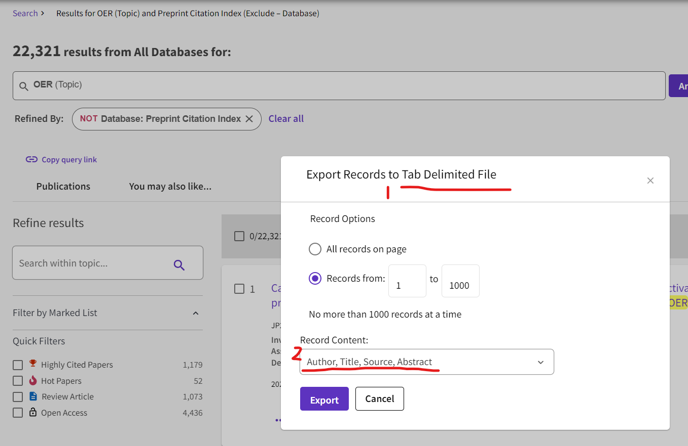

# SDA

SDA is an unsupervised approach to mine chemical data from literatures.

## 1. Requirements

#### 1.1 Python 3.6 or higher

#### 1.2 Others
```bash
pip install -r ./requirements.txt
```

## 2. Literature Data

#### 2.1 Abstract

Chemical entities and their functions can be extracted from the abstract. The abstracts can be downloaded via webofscience.

The abstract exported from webofscience should be in the **tab delimited format(1)** and contain **abstract(2)** as shown in follow:


The abstract exported from webofscience should be preprocessed by the following command:
```bash
python ./data_preprocess/paper_extractor.py
python ./data_preprocess/text_extractor.py
```

#### 2.2 Main Body/Supplement Information

Experimental procedure that contain chemical entities, properties and chemical operations can be extracted from the main body or the supplement information of the literature.

The main body and the supplement information of the literature should be in the PDF format.

The PDFs download please follow the specifications of each journal.

The PDFs should be preprocessed by the following command:

```bash
python ./data_preprocess/pdf_paper_extractor.py
python ./data_preprocess/text_extractor.py
```

## 3. Configuration

| key                        | description                                                                                 |
|----------------------------|---------------------------------------------------------------------------------------------|
| origin_papers_dn           | name of directory contain abstract files from wos or PDF files (provided by user)           |
| papers_fn                  | name of file contains papers (generated by the program)                                     |
| texts_fn                   | name of file contains texts (generated by the program)                                      |
| texts_tagged_fn            | name of file contains tagged texts (generated by the program)                               |
| tag_token_pairs_fn         | name of file contains tags and tokens (generated by the program)                            |
| words_vec_fn               | name of file contains trained word vector (generated by the program)                        |
| keywords_synonyms_fn       | name of file contains synonyms (generated by the program)                                   |
| min_distance               | the distance threshold between chemical entities and keywords in the syntax tree            |
| units_fn                   | name of file contains units of properties (generated by the program)                        |
| filter_units_fn            | name of file contains filtered units of properties (generated by the program)               |
| known_action_fn            | name of file contains known actions of chemical operations (provided by user)               |
| unknown_verbs_fn           | name of file contains unknown verbs (generated by the program)                              |
| unknown_verb_stem_count_fn | name of file contains the counts of stems of verbs (generated by the program)               |
| unknown_verb_score_fn      | name of file contain the score of verb (generated by the program)                           |
| action_fn                  | name of file contains chemical operations (generated by the program)                        |
| mols_fn                    | name of file contains chemical entities (generated by the program)                          |
| unique_mols_fn             | name of file contains deduplicated chemical entities (generated by the program)             |
| filter_mols_fn             | name of file contains filtered chemical entities (generated by the program)                 |
| elements_count_fn          | name of file contains the counts of elements (generated by the program)                     |
| elements_link_count_fn     | name of file contains the counts of the synergy between elements (generated by the program) |
| proj_oer_config:basic_abs  | configuration of OER projects inherited from basic_abs                                      |
| name                       | name of the project                                                                         |
| root                       | path of the directory contain all of the data                                               |
| target_mol_type            | "ALLOY" or "ORG", "ORG" means organic                                                       |
| keywords                   | list of keywords                                                                            |

## 4. Data Extractor

```bash
# Build Syntactic Tree
python ./data_extractor/nltk_parser.py
# or 
python ./data_extractor/nlp_parser.py

# Tokenize and POS Tagging
python ./data_extractor/tag_token_extractor.py

# Extract Chemical Entities with Specific Function
python ./data_extractor/mol_extractor.py

# Extract Properties
python ./data_extractor/unit_tagger.py

# Extract Chemical Operations
python ./data_extractor/action_tagger.py 
```

## 5. Analysis and Draw

```bash
# Alloy
python ./data_draw/alloy_draw.py

# Organic
python ./data_draw/org_mol_draw.py
python ./data_draw/org_sub_draw.py
```